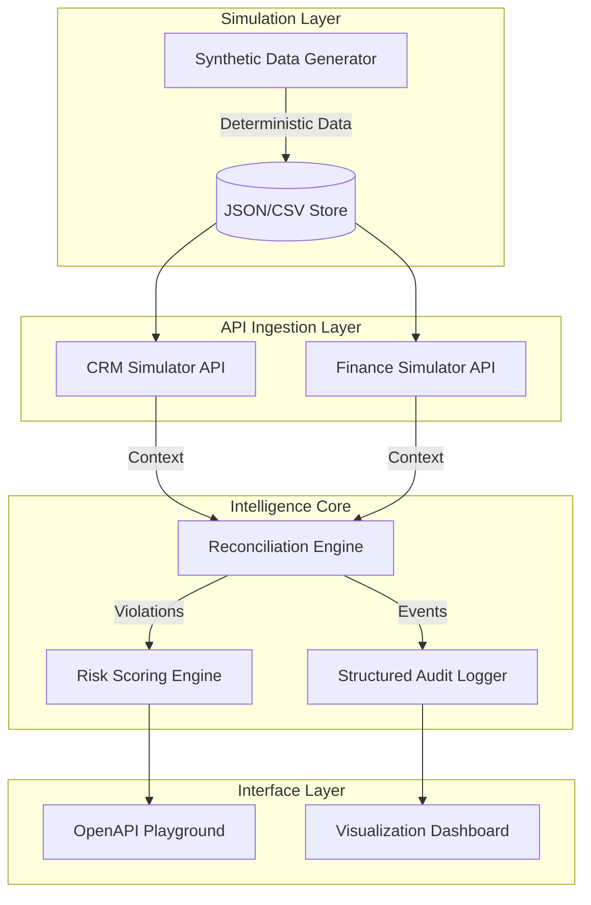

# Revenue Guard Engine — Technical Documentation

## 1. Executive Summary

Revenue Guard Engine is an enterprise-grade validation and risk-scoring platform designed to detect **Revenue Leakage** — the silent loss of revenue occurring due to discrepancies between CRM systems (Source of Truth for Sales) and Accounting platforms (Source of Truth for Finance).

The system automates the reconciliation of thousands of transactions, identifying pricing drift, duplicate invoicing, and missing payments with a sub-second response time, replacing weeks of manual auditing.

---

## 2. Problem Statement: The "Leakage" Gap

In high-growth B2B and SaaS environments, the bridge between CRM (e.g., GoHighLevel) and Finance (e.g., QuickBooks) is often leaky. Common failure points include:
- **Price Drift:** Sales reps offering unauthorized discounts not reflected in the final invoice.
- **Workflow Breaks:** Deals marked "Won" in CRM that never trigger an invoice in Finance.
- **Data Silos:** Payment status in Finance not syncing back to CRM fulfillment teams.
- **Operational Churn:** Manual auditors spending 40+ hours/week identifying basic data entry errors.

---

## 3. Solution Architecture

The Revenue Guard Engine is built on a modular, event-driven architecture designed for scalability and pluggable logic.

---

## 4. Technical Deep Dive: Functional Modules

### 4.1 Data Engineering: Synthetic Simulation
Instead of static mocks, the project uses a **Deterministic Data Generator** (`backend/data/synthetic_data_generator.py`) powered by `Faker`.
- **Anomalous Injection:** At a configurable rate (e.g., 5%), the generator injects 12+ specific anomaly types (missing invoices, price mismatches).
- **Relational Integrity:** Ensures that even "anomalous" records maintain logical links (Correlation IDs) for tracing.

### 4.2 Core Logic: The Rule Registry
The system uses a **Command Pattern** for validation. Every rule is a self-contained Python class inheriting from `ValidationRule`.
- **Pluggability:** New business rules can be added in `backend/core/rule_registry.py` without modifying the core orchestrator.
- **12+ Production Rules:** Covering Pricing Integrity (PRC), Order-Invoice consistency (OIC), and Cross-System Sync (CSI).

### 4.3 Analytics: Risk-Weighted Scoring
Unlike binary "Pass/Fail" systems, Revenue Guard computes a **Composite Risk Score (0-100)**:
- **Severity Weighting:** A `Critical` violation (Ghost Invoice) carries 3x the weight of a `Medium` one (Bulk Discount omission).
- **Classification:** Results are bucketed into `SAFE`, `MONITOR`, or `CRITICAL` for prioritized human intervention.

---

## 5. Technology Stack

| Component | Technology | Rationale |
| :--- | :--- | :--- |
| **Language** | Python 3.11+ | Optimal for data processing and rapid API development. |
| **API Framework** | FastAPI | Asynchronous performance with native OpenAPI/Swagger support. |
| **Data Logic** | Pandas & NumPy | High-performance vectorization for large-scale reconciliation. |
| **Visuals** | Matplotlib | Programmatic generation of high-quality audit reports. |
| **Testing** | Pytest-Asyncio | Robust verification of asynchronous API flows. |

---

## 6. API Ecosystem

The project features a **Unified OpenAPI Playground** accessible at `/docs`.

### Primary Endpoints
- `POST /api/v1/validation/run-full-scan`: Executes the entire 12-rule suite against all active transactions.
- `GET /api/v1/crm/orders`: Returns the simulated CRM state.
- `GET /api/v1/visualization/dashboard`: Returns the current system-wide leakage metrics.

---

## 7. Operational Auditing & Compliance

Security and transparency are baked into the core via the **Structured Audit Trail**:
- **JSON Format:** Every validation hit is logged as a machine-readable JSON object.
- **Traceability:** Every event contains a `correlation_id` linking the CRM Deal to the Finance Invoice and the Audit Log entry.
- **Persistence:** Logs are stored in `logs/audit_logs_YYYY-MM-DD.json`.

---

## 8. Extension & Future Roadmap

### How to Extend
1. **New Rules:** Subclass `ValidationRule` in `backend/core/rule_registry.py`.
2. **New Integrations:** Update the `ObjectStore` in `backend/api/` to pull from live APIs (GHL/QB) via OAuth2.
3. **New Visuals:** Implement a real-time D3.js or React dashboard consuming the existing JSON endpoints.

### Future Roadmap
- **[ ] Machine Learning:** Implementing anomaly detection using Isolation Forests to catch "unknown unknowns."
- **[ ] Live Connectors:** Production OAuth2 adapters for GoHighLevel and QuickBooks Online.
- **[ ] Multi-tenancy:** Support for multiple organizational accounts with partitioned data.

---

*This documentation is part of the Revenue Guard Engine Portfolio Delivery.*
