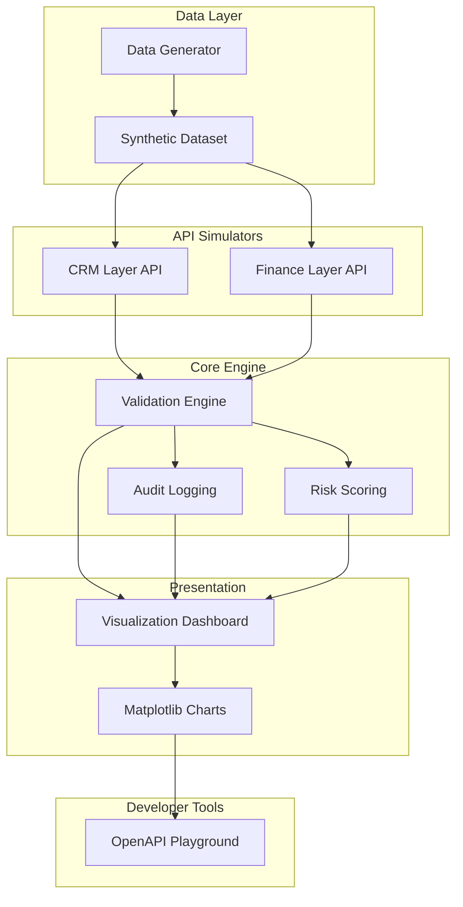

# Revenue Guard Engine

> **Project:** Revenue Leakage Detection & Validation Engine  
> **Type:** Upwork Portfolio Showcase  
> **Status:** Production-Ready / Portfolio-Grade

Revenue Guard Engine is a sophisticated validation and risk-scoring platform designed to identify revenue leakage between CRM systems (like GoHighLevel) and Accounting platforms (like QuickBooks). It uses synthetic data simulation to model complex business transactions and injects anomalies to demonstrate detection capabilities.

## 🏗️ Architecture



## 🚀 Quick Start

### 1. Installation

Requires Python 3.11+.

```bash
# Clone the repository
git clone https://github.com/username/revenue-guard-engine.git
cd revenue-guard-engine

# Create and activate virtual environment
python -m venv venv
source venv/bin/activate  # On Windows: venv\Scripts\activate

# Install dependencies
pip install -r requirements.txt
```

### 2. Execution

```bash
# Generate synthetic data (1,000+ transactions)
python generate_data.py

# Start the OpenAPI Playground
uvicorn playground.openapi_interface:app --reload --port 8000
```

- **OpenAPI Playground:** [http://localhost:8000/docs](http://localhost:8000/docs)
- **Visualization Dashboard:** Run `python -m visualization.dashboard` (or per project structure)

## ✨ Features

- **Synthetic Data Simulation:** Deterministic generation of Contacts, Deals, Orders, Invoices, and Payments with 12+ injected anomaly types.
- **CRM & Finance Simulators:** RESTful API layers acting as a bridge to simulated business entities.
- **Validation Engine:** 12+ sophisticated rules for identifying pricing drift, duplicate invoices, missing payments, and more.
- **Risk Scoring:** Weighted risk models that prioritize anomalies based on business impact.
- **Audit Logging:** Structured JSON audit trails with correlation IDs for every validation event.
- **Visualization:** Dynamic Matplotlib dashboards showing revenue trends, leakage rates, and risk distribution.
- **OpenAPI Playground:** Unified Swagger UI for exploring and testing all system components.

## 🛠️ Tech Stack

| Category | Technology |
|---|---|
| **Language** | Python 3.11+ |
| **API Framework** | FastAPI |
| **Data Processing** | Pandas, NumPy |
| **Visualization** | Matplotlib |
| **Synthetic Data** | Faker |
| **Testing** | Pytest, Pytest-Asyncio |
| **Documentation** | Swagger UI (OpenAPI) |

## 🧪 Testing

Run the full automated test suite:

```bash
PYTHONPATH=. pytest tests/ -v
```

## 📜 License

This project is licensed under the MIT License - see the LICENSE file for details.
