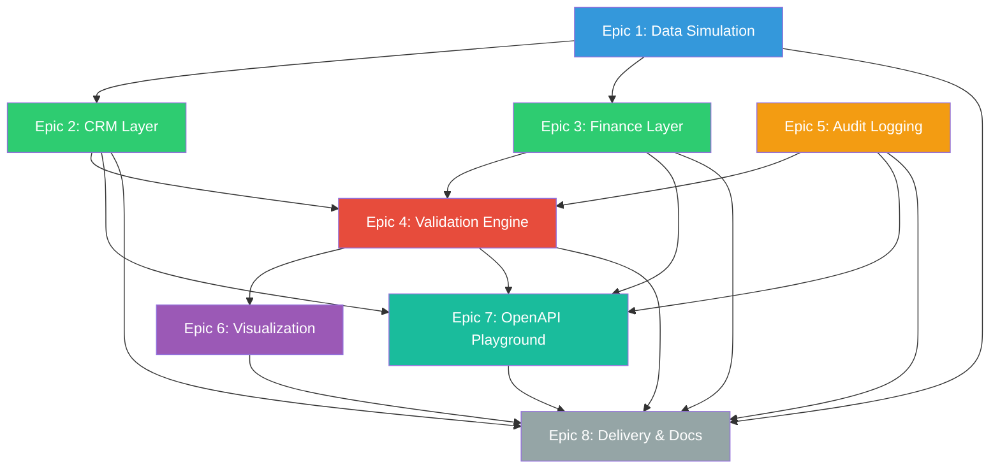

# Revenue Guard Engine — Epic Roadmap

> **Project:** Revenue Leakage Detection & Validation Engine  
> **Total Epics:** 8 | **Estimated Total Effort:** 22–30 days

---

## Dependency Graph

---

## Epic Summary

| # | Epic | Priority | Effort | Dependencies | Spec |
|---|---|---|---|---|---|
| 1 | [Data Simulation](file:///Users/adilhussain/Documents/AntiGravity/Revenue%20Leakage%20Detection%20%26%20Validation%20Engine/epics/epic-01-data-simulation/SPECIFICATION.md) | P0 | 3–4 days | None | Synthetic dataset with 1,000+ transactions and injected anomalies |
| 2 | [CRM Layer](file:///Users/adilhussain/Documents/AntiGravity/Revenue%20Leakage%20Detection%20%26%20Validation%20Engine/epics/epic-02-crm-layer/SPECIFICATION.md) | P0 | 3–4 days | Epic 1 | GoHighLevel-style REST API with contacts, deals, orders |
| 3 | [Finance Layer](file:///Users/adilhussain/Documents/AntiGravity/Revenue%20Leakage%20Detection%20%26%20Validation%20Engine/epics/epic-03-finance-layer/SPECIFICATION.md) | P0 | 3–4 days | Epic 1, 2 | QuickBooks-style API with invoices, payments, ledger |
| 4 | [Validation Engine](file:///Users/adilhussain/Documents/AntiGravity/Revenue%20Leakage%20Detection%20%26%20Validation%20Engine/epics/epic-04-validation-engine/SPECIFICATION.md) | P0 | 5–6 days | Epic 1, 2, 3, 5 | 12 validation rules, risk scoring, reconciliation |
| 5 | [Audit Logging](file:///Users/adilhussain/Documents/AntiGravity/Revenue%20Leakage%20Detection%20%26%20Validation%20Engine/epics/epic-05-audit-logging/SPECIFICATION.md) | P1 | 2–3 days | None | Structured JSON audit trail with correlation IDs |
| 6 | [Visualization](file:///Users/adilhussain/Documents/AntiGravity/Revenue%20Leakage%20Detection%20%26%20Validation%20Engine/epics/epic-06-visualization-dashboard/SPECIFICATION.md) | P1 | 3–4 days | Epic 1, 4 | 5 matplotlib charts + interactive dashboard |
| 7 | [OpenAPI Playground](file:///Users/adilhussain/Documents/AntiGravity/Revenue%20Leakage%20Detection%20%26%20Validation%20Engine/epics/epic-07-openapi-playground/SPECIFICATION.md) | P1 | 2–3 days | Epic 2, 3, 4, 5 | Unified FastAPI app with Swagger UI |
| 8 | [Delivery & Deployment](file:///Users/adilhussain/Documents/AntiGravity/Revenue%20Leakage%20Detection%20%26%20Validation%20Engine/epics/epic-08-delivery-deployment/SPECIFICATION.md) | P2 | 2–3 days | All | README, handover doc, tests, repo setup |

---

## Recommended Execution Order

### Phase 1 — Foundation (Week 1)
1. **Epic 1** — Data Simulation *(no dependencies, unlocks everything)*
2. **Epic 5** — Audit Logging *(no dependencies, can parallel with Epic 1)*

### Phase 2 — API Layers (Week 2)
3. **Epic 2** — CRM Layer
4. **Epic 3** — Finance Layer *(can parallel with Epic 2)*

### Phase 3 — Core Intelligence (Week 3)
5. **Epic 4** — Validation & Risk Scoring Engine

### Phase 4 — Presentation (Week 4)
6. **Epic 6** — Visualization & Dashboard
7. **Epic 7** — OpenAPI Playground *(can parallel with Epic 6)*

### Phase 5 — Polish (Week 5)
8. **Epic 8** — Delivery, Documentation & Deployment

---

## Tech Stack

| Category | Technology |
|---|---|
| Language | Python 3.11+ |
| API Framework | FastAPI |
| Data Modeling | Pydantic v2 |
| Data Processing | Pandas, NumPy |
| Visualization | Matplotlib |
| Synthetic Data | Faker |
| Testing | Pytest, pytest-asyncio |
| API Documentation | Swagger UI (built into FastAPI) |
