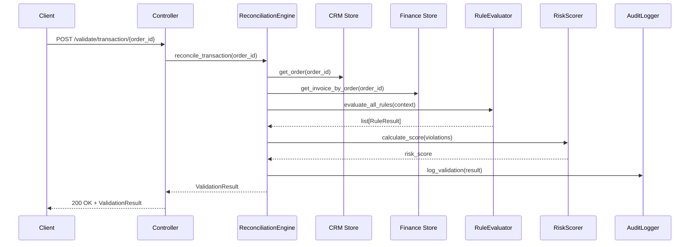

# Epic 4 — Intelligence Validation & Risk Scoring Engine

> **Priority:** P0 (Core Differentiator)  
> **Estimated Effort:** 5–6 days  
> **Dependencies:** Epic 1 (Data), Epic 2 (CRM Layer), Epic 3 (Finance Layer), Epic 5 (Audit Logging)  
> **Owner:** Backend Engineer / Business Logic Lead

---

## 1. Objective

Build the **core intelligence layer** — a deterministic, rule-based validation engine that reconciles CRM data against Finance data, detects revenue leakage, assigns risk scores, and produces actionable audit trails. This is the primary differentiator of the project.

---

## 2. Business Context

Revenue leakage occurs silently across the CRM-to-Finance pipeline. This engine sits between the two systems and answers three critical questions:

1. **Is the pricing correct?** (Pricing Integrity)
2. **Does the invoice match the order?** (Order → Invoice Consistency)
3. **How risky is this transaction?** (Leakage Risk Scoring)

---

## 3. Functional Requirements

### 3.1 Validation Rules

#### Rule Set 1 — Pricing Integrity

| Rule ID | Rule Name | Logic | Severity |
|---|---|---|---|
| `PRC-001` | Discount Threshold | `discount_pct > 15%` AND `approval_status != "approved"` → FAIL | Critical |
| `PRC-002` | Margin Protection | `(unit_price - cost) / unit_price < 0.10` → WARNING | High |
| `PRC-003` | Price Consistency | `abs(order.unit_price - invoice.unit_price) / order.unit_price > 0.01` → FAIL | Critical |
| `PRC-004` | Bulk Price Validation | If quantity > 100, ensure bulk pricing applied | Medium |

#### Rule Set 2 — Order → Invoice Consistency

| Rule ID | Rule Name | Logic | Severity |
|---|---|---|---|
| `OIC-001` | Order-Invoice Mapping | Order exists in CRM but no invoice in Finance → FAIL | Critical |
| `OIC-002` | Amount Matching | `abs(order.total - invoice.total) > 0.01` → FAIL | Critical |
| `OIC-003` | Duplicate Invoice | `count(invoices for order_id) > 1` → FAIL | High |
| `OIC-004` | Payment Completeness | `invoice.status = "paid"` but `sum(payments) < invoice.total` → FAIL | High |
| `OIC-005` | Stale Invoice | Invoice unpaid for > 60 days → WARNING | Medium |

#### Rule Set 3 — Cross-System Integrity

| Rule ID | Rule Name | Logic | Severity |
|---|---|---|---|
| `CSI-001` | Ghost Invoice | Invoice with `order_id` that doesn't exist in CRM → FAIL | Critical |
| `CSI-002` | Status Synchronization | CRM order "fulfilled" but invoice "overdue" → WARNING | High |
| `CSI-003` | Ledger Balance | `sum(debits) ≠ sum(credits)` for any account → FAIL | Critical |

### 3.2 Risk Scoring Algorithm

Each transaction receives a composite risk score based on rule violations:

```
Risk Score = Σ (rule_weight × violation_flag)
```

#### Weight Matrix

| Rule Category | Weight |
|---|---|
| Critical severity violation | 30 |
| High severity violation | 20 |
| Medium severity violation | 10 |
| Low severity violation | 5 |

#### Score Interpretation

| Score Range | Classification | Action |
|---|---|---|
| 0–30 | ✅ Safe | Auto-approve |
| 31–70 | ⚠️ Monitor | Flag for review |
| 71–100 | 🔴 Critical | Block + escalate |

> Scores are capped at 100.

### 3.3 API Endpoints

Prefixed with `/api/v1/validation/`.

| Method | Endpoint | Description |
|---|---|---|
| `POST` | `/validate/transaction/{order_id}` | Validate a single transaction |
| `POST` | `/validate/batch` | Validate a batch of transactions |
| `GET` | `/results` | List all validation results (paginated, filterable) |
| `GET` | `/results/{order_id}` | Get validation result for a specific order |
| `GET` | `/statistics` | Aggregated validation statistics |
| `GET` | `/risk-distribution` | Risk score distribution data |
| `POST` | `/run-full-scan` | Trigger validation across all transactions |

### 3.4 Validation Result Structure

```python
class ValidationResult(BaseModel):
    order_id: str
    risk_score: int                    # 0–100
    risk_classification: str           # "safe" | "monitor" | "critical"
    rules_evaluated: int
    rules_passed: int
    rules_failed: int
    rules_warned: int
    violations: list[RuleViolation]
    validated_at: datetime

class RuleViolation(BaseModel):
    rule_id: str                       # e.g., "PRC-001"
    rule_name: str
    severity: str                      # "critical" | "high" | "medium" | "low"
    message: str                       # Human-readable explanation
    expected_value: Optional[Any]
    actual_value: Optional[Any]
    weight: int
```

---

## 4. Technical Design

### 4.1 File Structure

```
backend/
  core/
    risk_scoring_engine.py        # Risk score calculation
    reconciliation_engine.py      # CRM ↔ Finance reconciliation
    rule_registry.py              # Rule definitions and registry
    rule_evaluator.py             # Rule evaluation logic
    __init__.py
  api/
    validation_controller.py      # FastAPI router for validation endpoints
  services/
    leakage_detection_service.py  # Orchestrates validation workflow
```

### 4.2 Rule Engine Architecture

```python
class RuleRegistry:
    """Central registry for all validation rules."""
    
    def register(self, rule: ValidationRule): ...
    def get_rules_by_category(self, category: str) -> list[ValidationRule]: ...
    def get_all_rules(self) -> list[ValidationRule]: ...

class ValidationRule(ABC):
    """Abstract base for all rules."""
    
    rule_id: str
    rule_name: str
    category: str
    severity: str
    weight: int
    
    @abstractmethod
    def evaluate(self, context: ValidationContext) -> RuleResult: ...

class RiskScoringEngine:
    """Calculates composite risk scores."""
    
    def calculate_score(self, violations: list[RuleViolation]) -> int: ...
    def classify_risk(self, score: int) -> str: ...

class ReconciliationEngine:
    """Orchestrates CRM ↔ Finance data comparison."""
    
    def reconcile_transaction(self, order_id: str) -> ValidationResult: ...
    def reconcile_all(self) -> list[ValidationResult]: ...
```

### 4.3 Validation Workflow



---

## 5. Acceptance Criteria

- [ ] All 12 validation rules are implemented and testable independently
- [ ] Risk scoring produces correct scores per the weight matrix
- [ ] Risk classification (Safe/Monitor/Critical) is accurate
- [ ] Batch validation processes all transactions in < 30 seconds for 1,000 records
- [ ] Validation results include human-readable violation messages
- [ ] Full-scan endpoint processes the entire dataset
- [ ] Statistics endpoint returns accurate aggregated metrics
- [ ] All validation events are sent to the Audit Logger (Epic 5)
- [ ] Unit tests validate each rule against known-good and known-bad data

---

## 6. Testing Strategy

| Test | Description |
|---|---|
| `test_prc001_unauthorized_discount` | 20% discount with no approval → assert Critical violation |
| `test_oic001_missing_invoice` | Order without invoice → assert Critical violation |
| `test_oic002_amount_mismatch` | Invoice amount ≠ order amount → assert violation with correct drift |
| `test_risk_score_calculation` | 2 Critical + 1 High violations → assert score = 80 |
| `test_risk_classification` | Score 75 → assert "critical", Score 25 → assert "safe" |
| `test_batch_validation` | Validate 100 transactions → assert all results returned |
| `test_full_scan` | Run full scan on seeded data → assert results match anomaly manifest |
| `test_clean_transaction` | Transaction with no violations → assert score = 0, status = "safe" |

---

## 7. Integration Points

| Direction | Counterpart | Description |
|---|---|---|
| **← Inbound** | Epic 2 | Queries CRM for order data |
| **← Inbound** | Epic 3 | Queries Finance for invoice/payment data |
| **→ Outbound** | Epic 5 | Sends audit events for every validation |
| **→ Outbound** | Epic 6 | Provides risk distribution and statistics data |
| **→ Outbound** | Epic 7 | Exposes validation endpoints in playground |

---

## 8. Out of Scope

- Machine learning or AI-based anomaly detection
- Real-time streaming validation
- Custom rule editor UI
- Multi-tenant rule configurations
